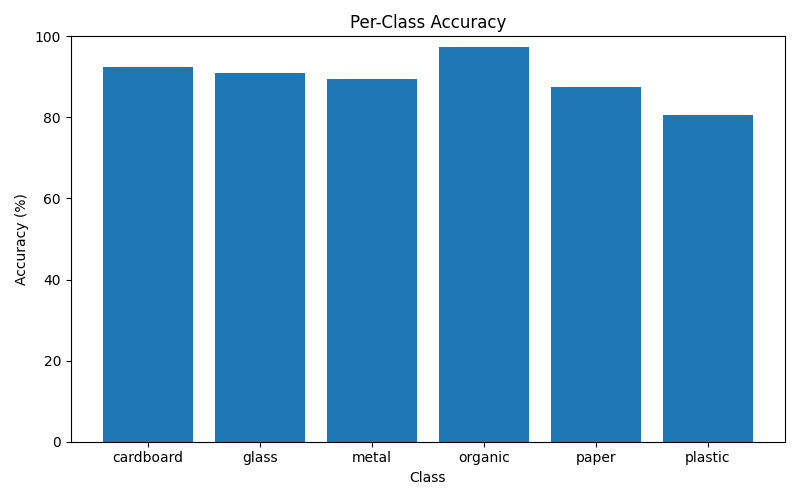
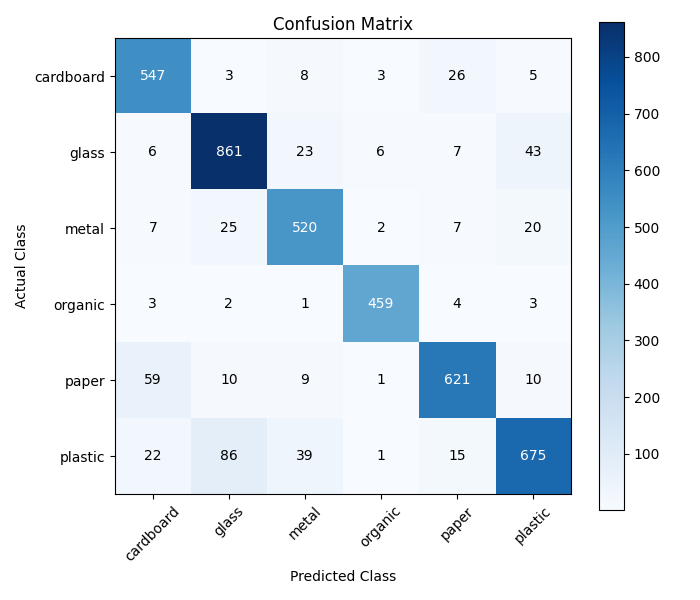

# Baseline Model Results

## Model

The baseline model uses MobileNetV2 with transfer learning.

- Dataset: MWCD
- Classes: 6
- Image size: 224 × 224
- Batch size: 32
- Epochs: 5

## Overall Results

- Training accuracy: 91.89%
- Validation accuracy: 88.98%
- Training loss: 0.2374
- Validation loss: 0.3094
- Approximate training time: 24 minutes
- Model size: 9.3 MB

## Per-Class Accuracy

The model performance for each class was:

- Cardboard: 92.40%
- Glass: 91.01%
- Metal: 89.50%
- Organic: 97.25%
- Paper: 87.46%
- Plastic: 80.55%

## Confusion Matrix

The confusion matrix shows how often each actual class was predicted as another class.

The main classification errors were:

- Plastic classified as glass: 86 images
- Paper classified as cardboard: 59 images
- Glass classified as plastic: 43 images
- Plastic classified as metal: 39 images

Plastic had the lowest per-class accuracy and was most often confused with glass.

Paper and cardboard also showed some confusion.

## Conclusion

The baseline model achieved a validation accuracy of 88.98%.

Organic had the highest per-class accuracy at 97.25%, while plastic had the lowest accuracy at 80.55%.

These results will be used as the baseline when testing improvements such as model tuning, data augmentation, and alternative lightweight models.